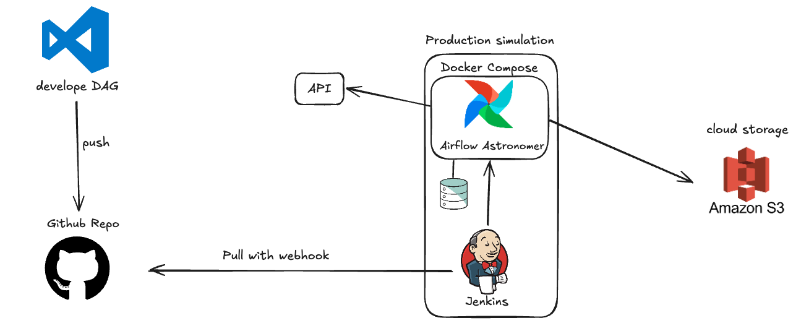
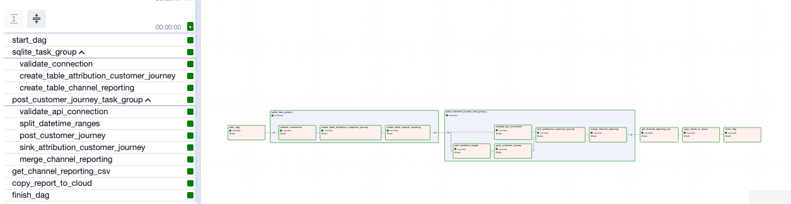

### pipeline IHC

This project involves designing and coding a data pipeline to perform the following tasks:

1. Query data from a provided SQLite database.
2. Transform the data as necessary.
3. Send the transformed data to an API to receive attribution results.
4. Write the attribution results back to the database.
5. Query and export the data from the database.
6. upload it to cloud path

